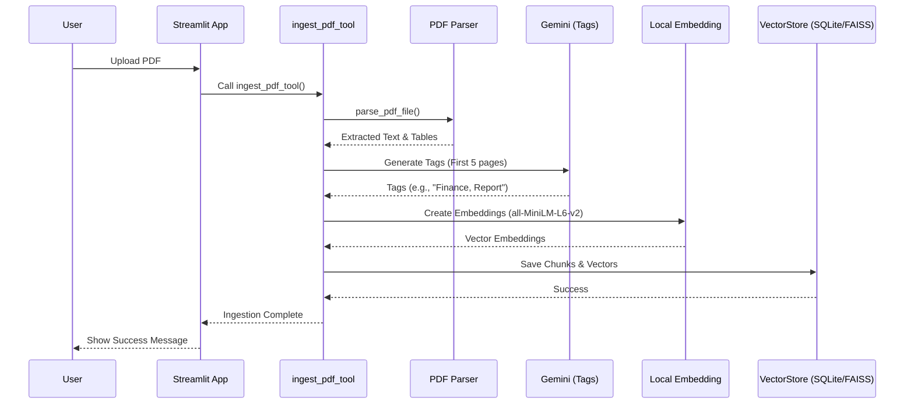
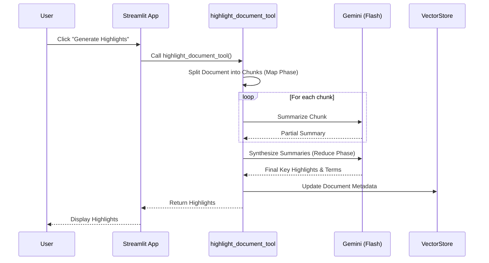
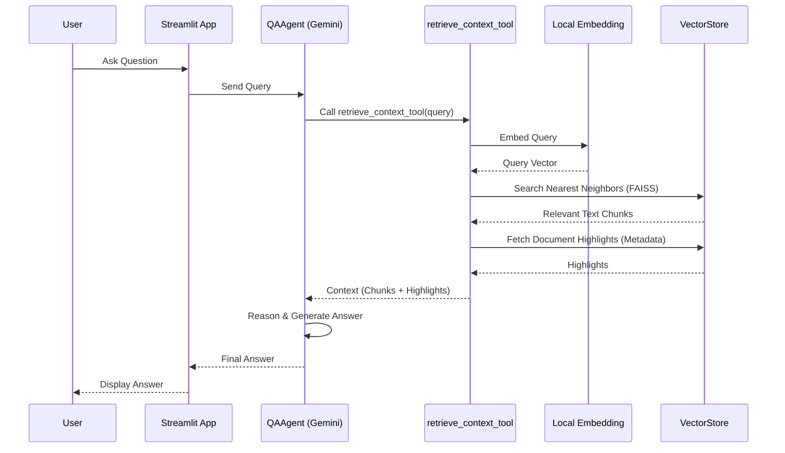

# 🏗️ Project Architecture & Directory Structure

This document provides a detailed overview of the project's file structure and the purpose of each component.

## 📂 Directory Structure

```
PDF_AGENT/
├── app.py                  # Main Streamlit application entry point
├── requirements.txt        # Python dependencies
├── .env                    # Environment variables (API keys)
├── README.md               # Project documentation
├── src/                    # Source code directory
│   ├── agent.py            # Agent definitions and configuration
│   ├── rag_engine.py       # RAG core logic and tool implementations
│   ├── database.py         # Vector store and database management
│   ├── pdf_parser.py       # PDF parsing utilities
│   └── session_cleanup.py  # Background session cleanup service
├── storage/                # Local storage for SQLite databases and FAISS indices
│   ├── session_activity.db # Tracks session activity timestamps
│   └── {session_id}_*.db   # Session-specific data (isolated)
├── uploads/                # Temporary storage for uploaded PDFs
│   └── {session_id}/       # Session-specific upload directories
└── logs/                   # Application logs
    └── app.log             # Main log file
```

---

## 📝 File Descriptions & Functions

### 1. `app.py` (Main Application)
The entry point for the Streamlit web interface. It handles the UI, session state, and user interactions.

*   **Key Responsibilities:**
    *   Initializes Streamlit session state (messages, documents, session ID).
    *   Starts the background `SessionCleanup` thread.
    *   Manages the chat interface (input/output).
    *   Handles file uploads and triggers processing.
    *   Instantiates the `Runner` to execute the Agent.
*   **Key Functions:**
    *   `run_cleanup_loop()`: Background thread that runs every hour to clean up expired sessions.
    *   `load_documents()`: Loads document metadata from the session's database.
    *   `update_session_activity()`: Updates the timestamp on every user interaction.

### 2. `src/agent.py` (Agent Configuration)
Defines the AI Agents and their available tools.

*   **Key Components:**
    *   `create_qa_agent()`: Factory function that creates the main **QAAgent**.
        *   **Model**: `gemini-2.5-flash-lite`
        *   **Tools**: `retrieve_context_tool`, `ingest_pdf_tool`, `highlight_document_tool`, `list_documents_tool`.
        *   **System Instruction**: Defines the agent's persona and rules for tool usage.

### 3. `src/rag_engine.py` (RAG Core)
Contains the core logic for Retrieval-Augmented Generation (RAG) and the implementation of tools used by the Agent.

*   **Key Tools (Functions exposed to Agent):**
    *   `ingest_pdf_tool(file_path)`: Orchestrates PDF parsing, auto-tagging, chunking, embedding generation, and storage.
    *   `retrieve_context_tool(query)`: Searches the vector database for relevant text chunks and returns them with citations.
    *   `highlight_document_tool(file_path)`: Uses a Map-Reduce approach with Gemini to generate key highlights and terms for a document.
    *   `list_documents_tool()`: Lists all available documents with their metadata (tags, highlights).
    *   `tag_document_tool(file_path)`: (Internal) Uses LLM to generate semantic tags for a document.
*   **Helper Functions:**
    *   `set_session_vector_store()`: Sets the active vector store for the current user session.
    *   `_chunk_pages()`: Splits text into overlapping chunks for embedding.

### 4. `src/database.py` (Storage Layer)
Manages the local SQLite database and FAISS vector index.

*   **Class `VectorStore`:**
    *   `__init__(session_id)`: Initializes session-specific database paths.
    *   `add_items()`: Stores text chunks in SQLite and embeddings in FAISS.
    *   `search()`: Performs vector similarity search using FAISS.
    *   `save_document_metadata()`: Stores document-level info (tags, highlights).
    *   `list_all_documents()`: Retrieves all uploaded documents for the session.

### 5. `src/pdf_parser.py` (PDF Processing)
Handles the extraction of text and tables from PDF files.

*   **Key Functions:**
    *   `parse_pdf_file(pdf_path)`: Uses `pdfplumber` to extract text page-by-page.
    *   `_format_table(table)`: Converts extracted table data into a readable Markdown/text format.

### 6. `src/session_cleanup.py` (Maintenance)
Implements the automatic cleanup logic for privacy and storage management.

*   **Class `SessionCleanup`:**
    *   `cleanup_expired_sessions()`: Main logic to scan and delete expired data.
    *   `_is_session_expired()`: Checks if a session has been inactive for > 6 hours.
*   **Functions:**
    *   `update_session_activity(session_id)`: Records the current timestamp in `session_activity.db`.

---

## 🤖 Agent Roles

| Agent Name | Role | Description |
| :--- | :--- | :--- |
| **QAAgent** | **Main Orchestrator** | The primary interface for the user. It decides which tool to use (search, highlight, list) based on the user's query. |
| **IndexerAgent** | Helper (Internal) | Responsible for ingesting raw text into the database (used internally by ingestion tools). |
| **RetrieverAgent**| Helper (Internal) | Specialized in finding relevant context (used internally by retrieval tools). |
| **HighlighterAgent**| Helper (Internal)| Specialized in summarizing and extracting key points from documents. |

---

## 🔄 Data Flow

### 1. PDF Upload & Ingestion Process
When a user uploads a PDF, the system processes it locally to ensure privacy before storing it in the vector database.



### 2. Auto-Highlighting (Map-Reduce)
Generating highlights involves a multi-step process to handle large documents effectively.



### 3. Q&A Retrieval Flow
When a user asks a question, the system performs a hybrid retrieval (Semantic Search + Metadata) to provide context to the LLM.



