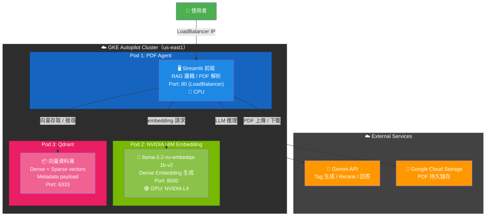
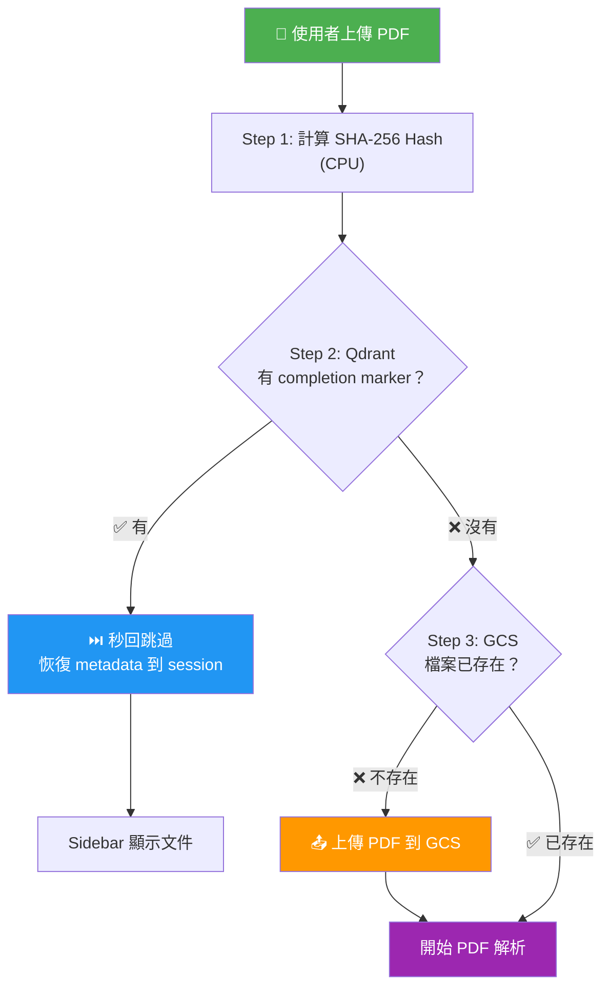
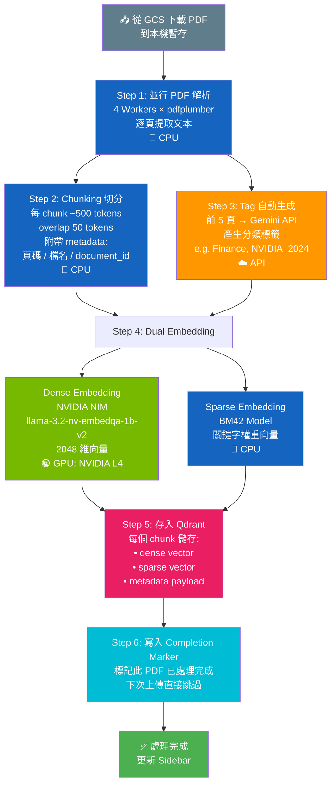
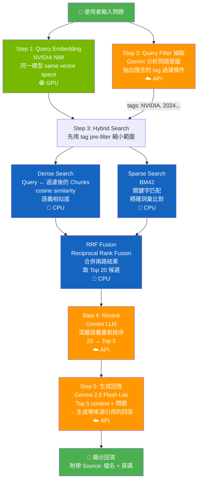
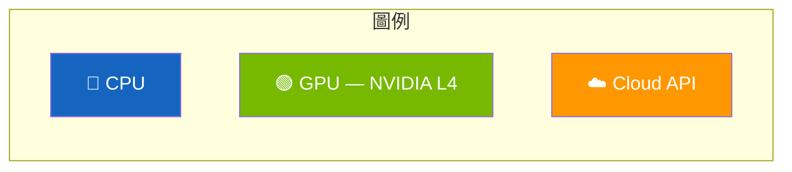

# PDF 解析 Pipeline 流程圖

## 🏗️ GKE 架構總覽

## 📤 上傳 & 去重流程

## 📄 PDF 解析 Pipeline

## 🔍 查詢 Pipeline

## 📊 各階段耗時參考（187 頁 NVIDIA Annual Report）

```mermaid
gantt
    title PDF 處理各階段耗時（187 頁 NVIDIA Annual Report）
    dateFormat ss
    axisFormat %Ss

    SHA Hash 計算           :a1, 00, 1s
    Qdrant Marker 查詢      :a2, after a1, 1s
    GCS 存在性檢查          :b1, after a2, 2s
    GCS 下載 PDF            :b2, after b1, 4s
    並行 PDF 解析 4 Workers  :c1, after b2, 82s
    Tag 生成 Gemini          :d1, after c1, 10s
    Dense Embedding NIM L4   :e1, after d1, 25s
    Sparse Embedding BM42    :e2, after d1, 5s
    Qdrant 批次寫入          :f1, after e1, 5s
    Completion Marker        :f2, after f1, 1s
```

| 階段 | 資源 | 耗時 | 說明 |
|------|------|------|------|
| SHA Hash 計算 | 🔵 CPU | ~0.1s | 本機 Python hashlib |
| Qdrant Marker 查詢 | 🔵 CPU | ~0.01s | HTTP → Qdrant Pod |
| GCS 存在性檢查 | ☁️ API | ~2s | GCS API call |
| GCS 下載 PDF | ☁️ API | ~4s | 50MB PDF |
| 並行 PDF 解析 | 🔵 CPU | ~82s | 4 processes（ProcessPoolExecutor）× pdfplumber |
| Tag 生成 | ☁️ Gemini API | ~5-15s | 前 5 頁送 Gemini |
| Dense Embedding | 🟢 **GPU (L4)** | ~20-30s | NVIDIA NIM, 2048 維 |
| Sparse Embedding | 🔵 CPU | ~5s | BM42 本地模型 |
| Qdrant 寫入 | 🔵 CPU | ~5s | Batch upsert |
| Completion Marker | 🔵 CPU | ~0.01s | 單筆 upsert |
| **總計** | | **~2-2.5 min** | |
